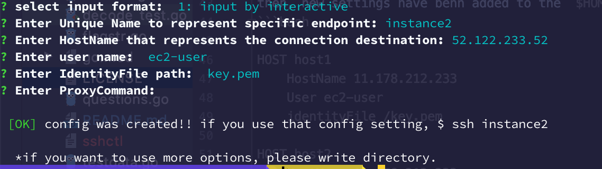
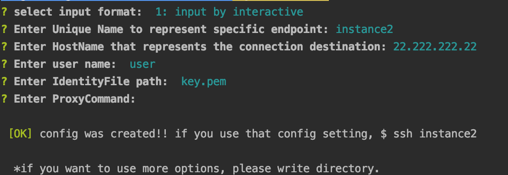

# sshctl
`sshctl` is a interactive cli for editing ssh config.

## How to install

```bash
$ go get gihub.com/dasuken/sshgen
```

**manually:**

Download binary from release page

## Usage
### add
from command



or, use interactive option



then, new settings have benn added to the `$HOME/.ssh/config`
```bash

HOST host1
	HostName 11.178.212.233
	User ec2-user
	identityFile /key.pem

HOST host2
	HostName 11.178.212.233
	User ec2-user
	identityFile /key.pem
``` 

### list

```bash
$ sshctl list
0: host1 
1: host2 
```

## Roadmap
- [ ] Add Test
- [ ] UPDATE
- [ ] DELETE

# LICENCE

MIT licence